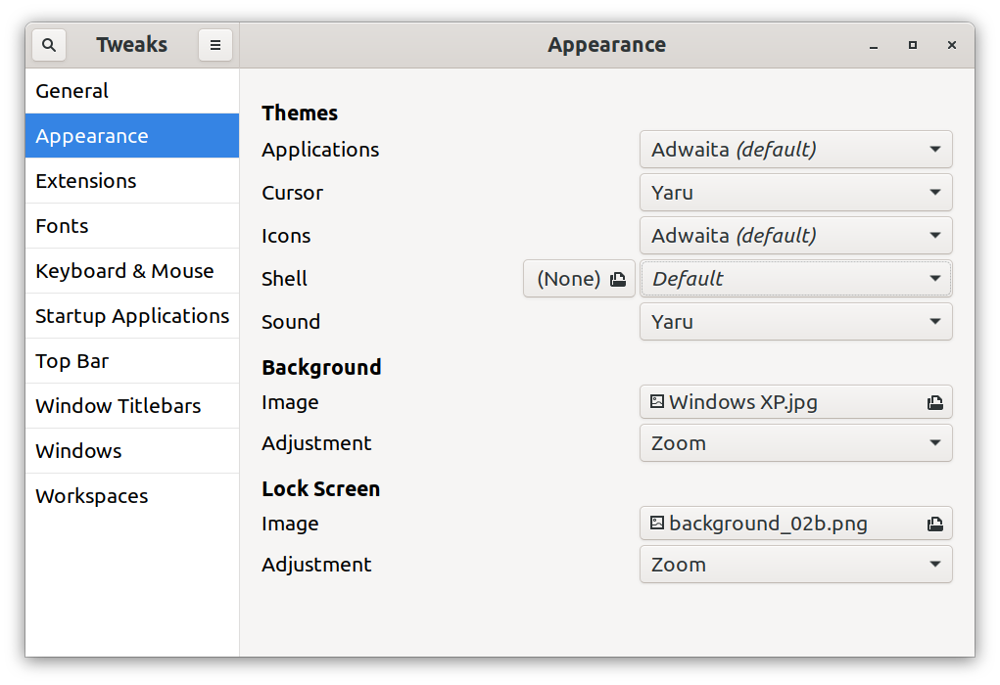
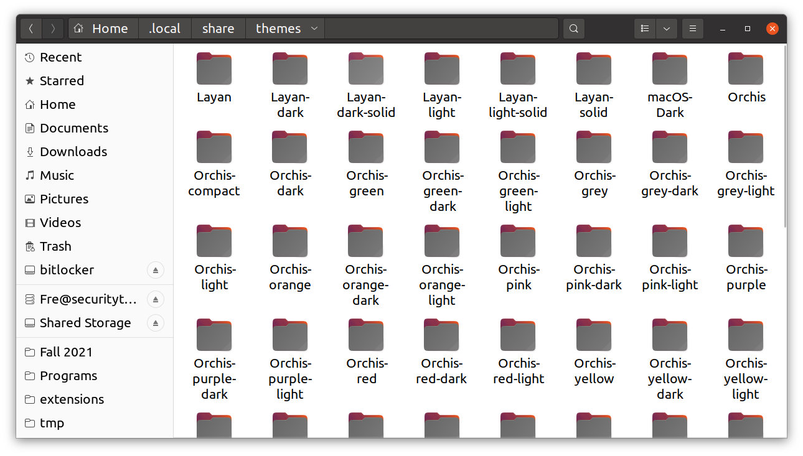
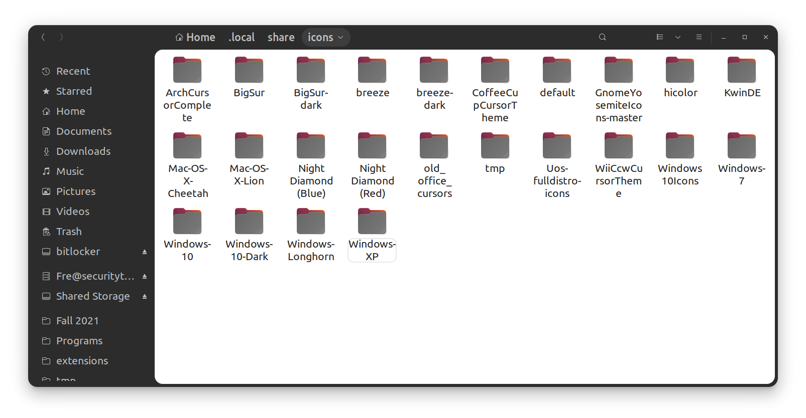
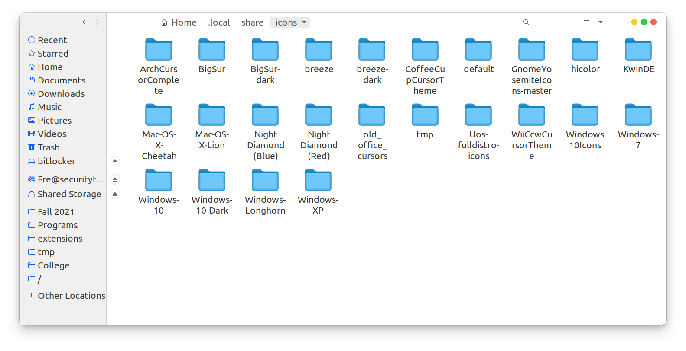
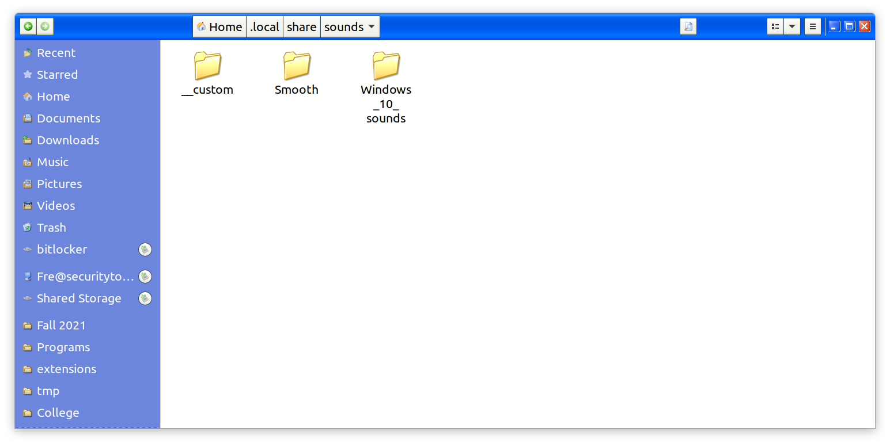
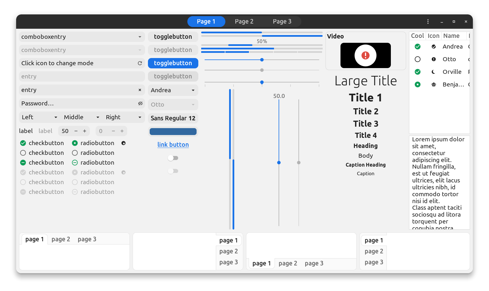
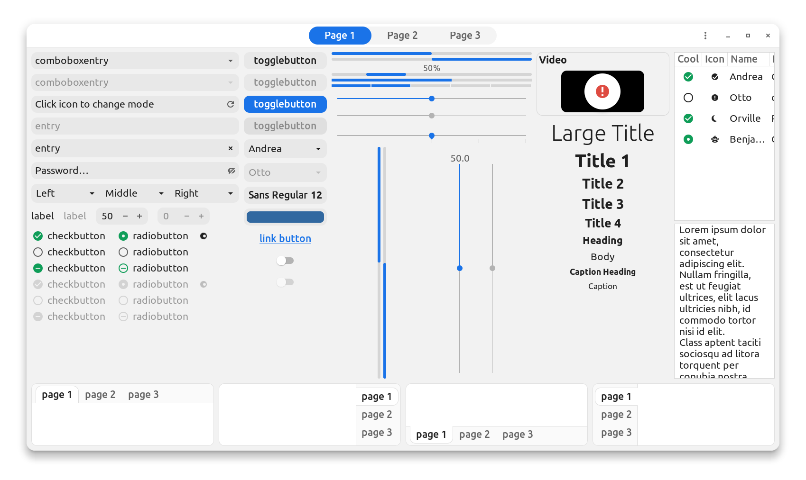
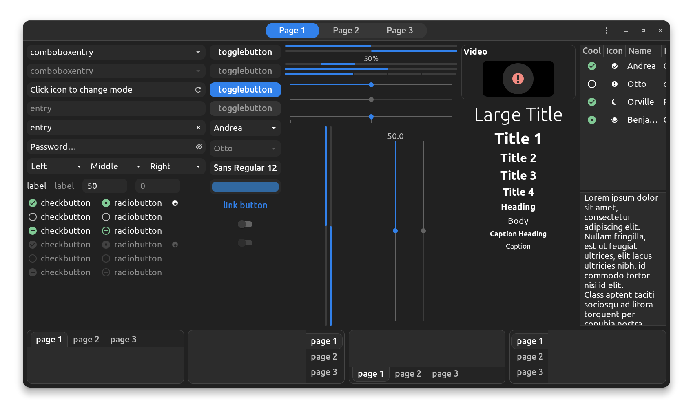
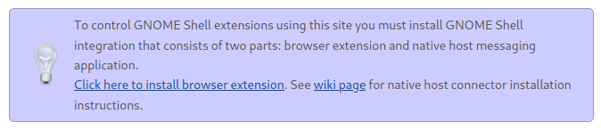

# Install the User Theme Gnome Extension

Ubuntu uses the window manager Unity, but (almost) everything in Ubuntu is themed by GTK. Almost everything you will use will be themed in this way.

In order to theme Ubuntu, you first should install the User Themes Gnome extension. This will give you more control over theming of the system rather than only theming your applications.

```bash
sudo apt install gnome-shell-extensions -y

cd /tmp

wget https://extensions.gnome.org/extension-data/user-themegnome-shell-extensions.gcampax.github.com.v42.shell-extension.zip

mkdir -p ~/.local/share/gnome-shell/extensions/user-theme@gnome-shell-extensions.gcampax.github.com

unzip -q /tmp/user-themegnome-shell-extensions.gcampax.github.com.v42.shell-extension.zip -d ~/.local/share/gnome-shell/extensions/user-theme@gnome-shell-extensions.gcampax.github.com/
```

Log out and log in to restart your Gnome Shell

```
gnome-extensions enable user-theme@gnome-shell-extensions.gcampax.github.com
```

# Install Gnome Tweaks

```bash
sudo apt install gnome-tweaks -y
```

Now, launch the Gnome Tweaks application. You'll see there's a lot you can customize, but we'll be focusing on the appearance.

Go to the Appearance tab. You may need to expand the window to see the left sidebar.



You can now choose any of the built-in themes, mice, etc.!

I've generally found it looks best to have the same Application and Shell theme.

But you didn't come here just to scrape the surface - you came here to install and make your own themes!

# Install themes from online

The website [gnome-look.org](https://www.gnome-look.org/) is one of the best places I've found to look for themes online. There are plenty of other places online to find themes (search for "GTK Themes"), but I usually use Gnome Looks.

**IMPORTANT NOTE: The Pling Store advertised for downoad on Gnome Looks' website contains an unpatched XSS vulnerability which could lead to remote code execution (RCE)** (https://marketresearchtelecast.com/several-linux-app-stores-pling-store-apps-can-be-attacked-via-cross-site-scripting/83431/)! **Use it at your own risk!** I am unsure whether their website is vulnerable as well. I still use their website to download themes, but **do not download and install their app!** The app was last updated 2 years ago, so it is certianly vulnerable.

Other important note - you are downloading things from the internet! While I use Gnome Looks, I am not responsible for any viruses, malware, etc. that gets on your computer for this. It's your choice to download and install themes, not mine!

## Install a Application/Shell theme

This will give your computer the biggest overhaul. This will change the appearance of buttons, windows, and many other parts of your experience.

First, find a theme you like. Themes can be found by browsing Gnome Looks (look at GTK2 Themes and GTK3/4 Themes) or searching online. Once you find a theme you like, click "Download" and choose the theme variant you like.

Create a folder `/home/username/.local/share/themes`. Unzip the folder into the themes directory:



Inside this folder, there should be (at the very least) an `index.theme` file.

Quit and reopen Gnome Tweaks. Your new theme should now be an option under appearances.

## Install an Icon Theme

First, find an icon theme you like. Icon packs can be found by browsing (look at Full Icon Themes) or searching. Once you find an icon theme you like, click "Download" and choose the theme variant you like.

Create a folder `/home/username/.local/share/icons`. Unzip the folder into the icons directory:



Inside this folder, there should be (at the very least) an `index.theme` file.

Other themes will contain an install script. Always be careful what random internet code you run on your device!

Now, quit and reopen Gnome Tweaks. Your new icon theme should now be an option under appearances.

## Install a Cursor Theme

First, find an cursor theme you like. Themes can be found by browsing (look at Cursors) or searching. Once you find an cursor theme you like, click "Download" and choose the theme variant you like. Notice that some of the themes will have an option to install listed for Windows. These downloads will not work for Linux.

Create a folder `/home/username/.local/share/icons`. Unzip the folder into the icons directory:



Inside this folder, there should be (at the very least) an `index.theme` file.

Now, quit and reopen Gnome Tweaks. Your new cursor theme should now be an option under appearances. After choosing a mouse theme, you may need to move your mouse a bit to see it change.

## Install a Sound Theme

First, find an sound theme you like. Honestly, I haven't bothered with a different sound theme and I don't remember where I found the one I have installed, so you're on your own for finding it.

Create a folder `/home/username/.local/share/sounds`. Unzip the folder into the sounds directory:



Inside this folder, there should be (at the very least) an `index.theme` file.

Now, quit and reopen Gnome Tweaks. Your new sound theme should now be an option under appearances (don't ask me why).

# Tips

If you change your theme, you may need to also find a background, icon theme, etc. which matches your new theme

My favorite theme is probably the variants of the Orchis theme:







The [B00merang Team](https://b00merang.weebly.com/) has pretty good recreations of lots of OSs' themes (multiple versions of Windows, MacOS, Google, etc.). Check them out!

## Gnome Extensions

To further customize your desktop, check out some [Gnome Extensions](https://extensions.gnome.org/). These can be used to add all sorts of functionality to your desktop! The easiest way to add these to your system is by installing Gnome's browser extension:



Some Gnome Extensions that I use regularly include:

- [Compiz](https://extensions.gnome.org/extension/3210/compiz-windows-effect/)
- [Dash to Dock](https://extensions.gnome.org/extension/307/dash-to-dock/)
- [Just Perfection](https://extensions.gnome.org/extension/3843/just-perfection/)
- [Night theme switcher](https://extensions.gnome.org/extension/2236/night-theme-switcher/)
- [Tiling assistant](https://extensions.gnome.org/extension/3733/tiling-assistant/)

There's all sorts of cool things you can do! Bear in mind that this is software you're downloading from the internet, but most of it is open source, so you can check their source code if you like. The link will be posted on the download page.